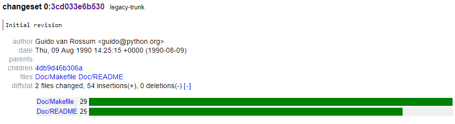
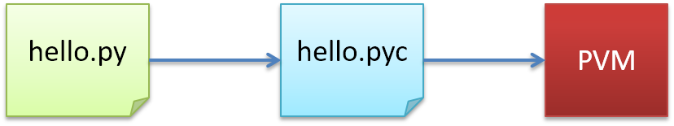

## "Hello World"

> ["Hello World" on another languages](http://helloworldcollection.de/)


### Canonical example


🪄 _<mark style="color:green;">Code:</mark>_

```python
print("Hello World")
```

📟 _<mark style="color:green;">Output:</mark>_


```
Hello World
```



🪄 _<mark style="color:green;">Code:</mark>_

```python
print "Hello World" # Python 2
```

📟 _<mark style="color:green;">Output:</mark>_


```
Hello World
```



## What is Python?


```python
import antigravity
```


> Python is high-level dynamically typed interpreted programming language. Its design philosophy emphasizes code readability, and its syntax allows programmers to express concepts in fewer lines of code than would be possible in languages such as C++ or Java.
    
> *There should be one — and preferably only one — obvious way to do it*

* Universality - general purpose:
    * Machine Learning, Web, Testing, services, game logic, math, science, education
    * except DBs and things that required super fast computing

### History of Python (brief)


* The programming language Python was conceived in the late **1980**s, and its implementation was started in December **1989** by Guido van Rossum at CWI in the Netherlands.

* Python was named for the BBC TV show [Monty Python's Flying Circus](https://en.wikipedia.org/wiki/Monty_Python%27s_Flying_Circus).

<center></center>

* [Guido van Rossum](https://en.wikipedia.org/wiki/Guido_van_Rossum) is Python's principal author, and his continuing central role in deciding the direction of Python is reflected in the title given to him by the Python community, **Benevolent Dictator for Life (BDFL)**.

* In July 2018, van Rossum announced that he would be stepping down from the position of BDFL of the Python programming language. Many thinks that's why:

> "Now that PEP 572 is done, I don't ever want to have to fight so hard for a PEP and find that so many people despise my decisions."


* First commit to [SVN](https://hg.python.org/cpython/):

<center></center>

* **Python 1.0** was released on January 1994.


* **Python 2.0** was released on October 16, 2000, with many major new features, including a cycle-detecting garbage collector (in addition to reference counting) for memory management and support for Unicode.


* **Python 3.0**, a major, backwards-incompatible release, was released on December 3, 2008 after a long period of testing. Many of its major features have also been backported to the backwards-compatible Python 2.6 and 2.7.


> Full history is described in [Wikipedia](https://en.wikipedia.org/wiki/History_of_Python)

## Python in modern world

Python is used in these three areas the most now:

1. Data Science and Machine Learning
1. Web Programming
1. Testing

## Pluses/Minuses of Python:

### Pluses:

* Readability and indentations
* Understandable tracebacks
* Pretty fast for it's tasks - web, UI, math, analyse (PyPy, Cython, numpy, scipy)
* Community (for FullStackOverflow developers)
* Ducktyping
* Tons of packages

\* Ducktyping - some common behavior of different object.

### Minuses:
* No JIT
    * In Python code is executed after pre-compilation (bytecode creation)
* Not fast compared to C, Rust, Java, Go and more memory-hungry
* Python object realization is costly
* Problems with concurrency (Global Interpreter Lock)
* Problems with sandboxing

### Why Python slower then compiled languages?

<span title="Advanced topic" style="position: absolute; top: 25px; right: 30px; font-size: 250%; color:red">🔥</span>

1. Python is Dynamically Typed rather than Statically Typed.
2. Python is interpreted rather than compiled.
A smart compiler can look ahead and optimize for repeated or unneeded operations, which can result in speed-ups
3. Python's object model can lead to inefficient memory access

### Comparison Python with other languages

* Java

Python programs are generally expected to run slower than Java programs, but they also take much less time to develop. Python programs are typically 3-5 times shorter than equivalent Java programs. This difference can be attributed to Python's built-in high-level data types and its dynamic typing. For example, a Python programmer wastes no time declaring the types of arguments or variables, and Python's powerful polymorphic list and dictionary types, for which rich syntactic support is built straight into the language, find a use in almost every Python program. Because of the run-time typing, Python's run time must work harder than Java's. For example, when evaluating the expression a+b, it must first inspect the objects a and b to find out their type, which is not known at compile time. It then invokes the appropriate addition operation, which may be an overloaded user-defined method. 


* C++

Almost everything said for Java also applies for C++, just more so: where Python code is typically 3-5 times shorter than equivalent Java code, it is often 5-10 times shorter than equivalent C++ code! Anecdotal evidence suggests that one Python programmer can finish in two months what two C++ programmers can't complete in a year. Python shines as a glue language, used to combine components written in C++.

## Python 2/3

There are two main branches of Python: 
* Python 2 (~ 2.7.17)
    * The old branch with the support stopped at January 2020.
* Python 3 (~ 3.10)

Python 3 is a "big hotfix" for a lot of different issues found in Python 2 over the years.

Python 3 is the only current version of Python. Python 2 is almost dead and while it still can be found pre-installed on some OS distributions (Linux and Mac OSX) it will be replaced by Python 3 as the new default everywhere.

Differences are not so big in general syntax. It looks almost identical to Python 2. The most noticable change is that `print` is a function in Python 3, so it requires a parentheses surrounding the arguments.

### Changes in print:


|  Python 2   |  Python 3    |    Result   |
|-------------|--------------|-------------|
|`print`                 | `print()`                 | *empty line* (`\n` or `\r\n`)
|  `print "Hi!"`         |  `print("Hi!")`           |<b>Hi!</b>      
|  `print "Hi!",`        |  `print(" Hi! ", end="")` |<b>Hi!</b> (no `\n` at the end)   
|  `print "2 + 2 =", 2+2` | `print("2 + 2 =", 2*2)` |<b>2 + 2 = 4</b>      
|  N/A      |  `print(1, 2, 3, sep="--")`            |<b>1--2--3</b> (with seperator)      


Additionally:

* Many methods don't return lists (results are iterators now):
    * `dict.keys()`, `dict.items()`, `dict.values()` 
    * `map()`, `filter()`, `zip()` 
    * `range()` = `xrange()` from Python 2 
* Iterator protocol change: `next()` -> `__next__()` 
* str = unicode 
* Different types objects comparison (you can't compare `str` and `int`) 
* PEP8 fixes

Bonus:
* Annotations (used for visualizing code and for data classes in Python 3.7)
```python
def foo(a: 'x', b: 5 + 6, c: list) -> max(2, 9)
```

* Cool unpacking: 
```python
(a, *rest, b) = range(5)
``` 
* New `super()` – you don't need to write what class to extend (we'll learn about them in OOP section)
* Asyncio (versions 3.4, 3.5+)
* String interpolations (3.6+)
* Data classes (3.7+)


### Python interpreter

* Interpreter - mean it runs code almost "live"
* Downloadable from https://www.python.org/ 
* Python is script language but still it compiles runtime code in a form of so called bytecode which Python Virtual Machine (PVM) runs (just like Java does with it's JVM):


* Compiled code is auto-created and stored in .pyc files (for Python 3 they are in separate `__pycache__` directory)


#### Running Python

> Installation covered [later](#Installation,-IDEs-etc.)

* Interactive shell (UNIX/Windows): 
    * Type commands line by line and see the results immediately

```sh
$ python
```

* Run script (stored in a text file with `.py` extension):

```sh
$ python script.py
```

* Run an inline script: 

```sh
$ python -c "print('Hello World yo!')"
```

* Running a specific module:
```sh
$ python -m pip list
```