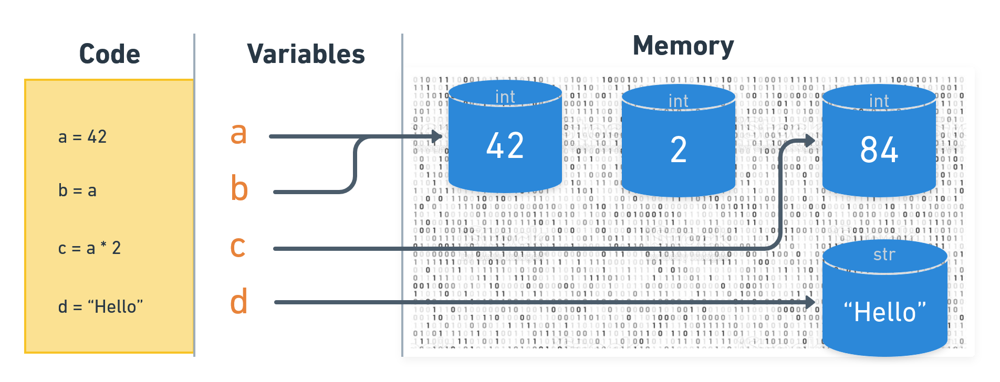
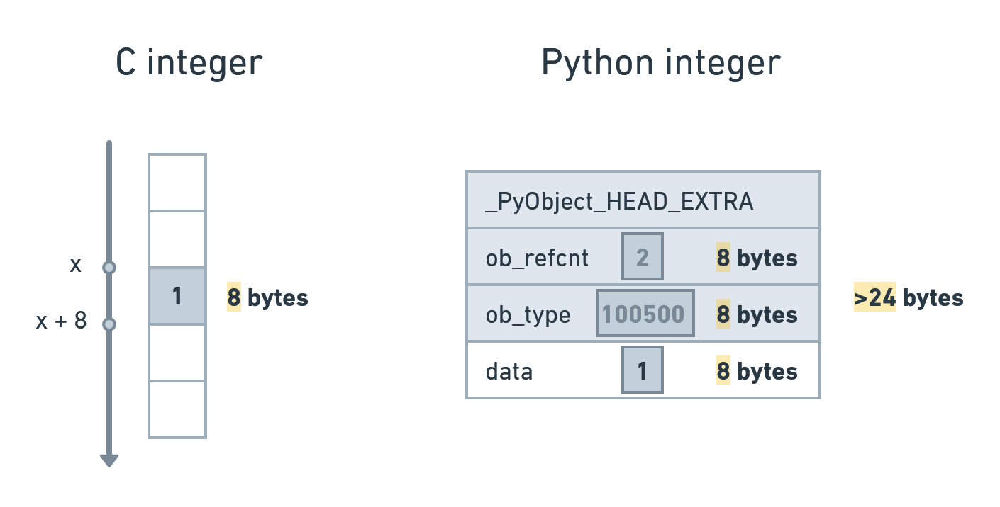

## Objects in Python

## Everything is an object

<span title="This is important" style="position: absolute; top: 25px; right: 30px; font-size: 250%; color:red">ℹ️</span>

Every data stored in the computer is a sequence of `1` and `0` - bits of information. We can interpret those bits as data of various types (like text data, numbers and sequences of those) or even as computer code itself that we can store and run. 

The same data can be interpreted differently thus the type of data is as important as the value/content. The following data can be treated as `97` or `a`:

<span style="font-family: Consolas; font-size: 200%">1100001</span>

Below is the base example how we assign the data to the variables (in Python terms this is often called as "binding"):


```python
a = 42
```

**42** is the data in memory, it is the Python object of **int** type (integer).

**a** is variable, it is like a pointer to a data, like a label of the data so we could operate with it in the code easier.

* Variable - pointer to a object
* Object - specific structure in memory

So: variable holds a value. You can change the value of a variable at any point. In this case variable will just point to another object. Old object will remain but if it won't be referenced by any variable it will be cleaned out.

When we do:

```a = 42``` 

we bind name ```a``` from namespace to an object ```42```. 

> A namespace is a mapping from names (identifiers) to objects. 

You can rebind that name to another object (even different type than previous) - this called rebinding. 

Also that name can be unbound by ```del a```. 

<span title="This is important" style="position: absolute; top: 25px; right: 30px; font-size: 250%; color:red">ℹ️</span>

Simplified schema how code, variables and objects in memory interconnected:



The variable itself doesn't have a specific type by itself, it should be considered as a "name" or some kind of a "tag" attached to the object. In some sense it just points  to the object. Assignment does not copy a value - it just attaches a name to the object that contains the data. Also that's why we can reassign it to another object:


```python
a = 42
print(f"#1. a now is {a}")

a = [1, 2, a]
print(f"#2. a now is {a}")

a = "Hello"
a = a + " World"
print(f"#3. a now is {a}")
```

<pre class="notranslate" style="display:block; white-space: pre-wrap; padding:16px; background-color: #000;color: #e2e2e2;font-family: Hack, Consolas, Menlo, Mono, monospace;border-left: .25em solid #bc0000;"><code>#1. a now is 42
    #2. a now is [1, 2, 42]
    #3. a now is Hello World</code></pre>


A lot of variables can point to same object. You don't need to declare what exact type variable should be.

* Compare objects by value: ```==```
* Compare objects by id: ```is```


```python
a = 100500
b = a
print("a == b →", a == b)
print("a is b →", a is b)
```

<pre class="notranslate" style="display:block; white-space: pre-wrap; padding:16px; background-color: #000;color: #e2e2e2;font-family: Hack, Consolas, Menlo, Mono, monospace;border-left: .25em solid #bc0000;"><code>a == b → True
    a is b → True</code></pre>


```python
a = 100500
b = 100500
print("a == b →", a == b)
print("a is b →", a is b)
```

<pre class="notranslate" style="display:block; white-space: pre-wrap; padding:16px; background-color: #000;color: #e2e2e2;font-family: Hack, Consolas, Menlo, Mono, monospace;border-left: .25em solid #bc0000;"><code>a == b → True
    a is b → False</code></pre>


<span title="Advanced topic" style="position: absolute; top: 25px; right: 30px; font-size: 250%; color:red">🔥</span>

Everything that Python operates with in a program is represented by some kind of object. This includes basic types like strings, integers, lists and also - functions, classes, modules etc. Even type itself is object of class `type`.

In Python, an object is a chunk of data that contains at least the following:
* A `type` that defines what it can do
* A unique `id` to distinguish it from other objects
* A `value` consistent with its type
* A `reference count` that tracks how often this object is used

## Python memory model

<span title="Advanced topic" style="position: absolute; top: 25px; right: 30px; font-size: 250%; color:red;">🔥</span>

Python itself is written in `C` (btw - not `C++`) and so each object in Python is modelled in `C` language as the spefic structure (set of different attributes). In terms of `C` they are `PyObject` `struct` or one of its variants. Here's what `PyObject` looks like:

```c
typedef struct _object {
    _PyObject_HEAD_EXTRA
    Py_ssize_t ob_refcnt;
    PyTypeObject *ob_type;
} PyObject;
```

This is the very base class for all objects in Python. We can see that every object has a pointer to it's type and and reference counter. All specific types like `int` (integer numbers) or `str` (string) has another base class defined that is derived from `PyObject`. 


<span title="Advanced topic" style="position: absolute; top: 25px; right: 30px; font-size: 250%; color:red">🔥</span>

Difference between a object of basic type in `C` and `Python`:


So any Python object includes at a minimum:

* A reference count, tracking how many references there are to the object.
* A pointer to the type, in our case the integer type.
* Whatever data is needed to store the object itself:
    * for numbers like `int`, `float` etc. - it's the value itself
    * for sequences - pointer to sctucture in memory which holds member objects

On a 64-bit operating system (the default these days) those first two items mean a minimum of `16` additional bytes of overhead. 

### Naming rules

* Variables can only contain letters, numbers, and underscores. Variable names can start with a letter or an underscore, but can not start with a number.
* Spaces are not allowed in variable names, so we use underscores instead of spaces. For example, use student_name instead of "student name".
* You cannot use Python keywords as variable names.
* Be careful about using the lowercase letter l and the uppercase letter O in places where they could be confused with the numbers 1 and 0.