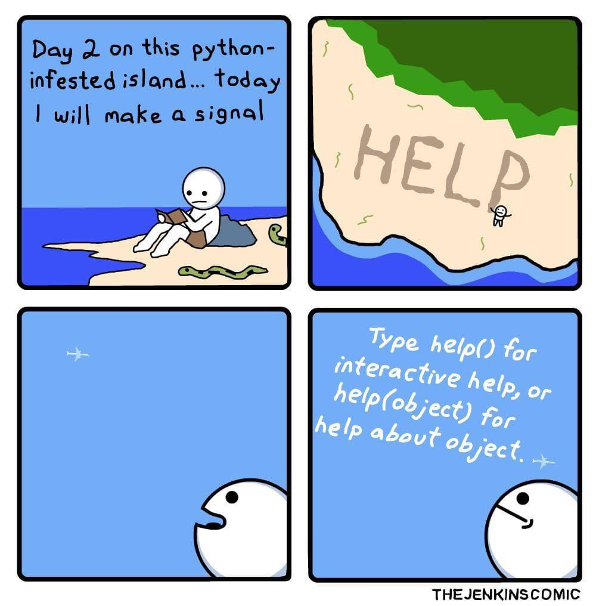

## Getting help



* Help
    * In Python interactive shell:
🪄 <mark style="color:red;">Code</mark>:

```python
help(math.sqrt)
```
📟 <mark style="color:green;">Output</mark>:


```
* IPython shell:
```

🪄 <mark style="color:red;">Code</mark>:

```python
math.cos?
```
📟 <mark style="color:green;">Output</mark>:


```
* Web: https://docs.python.org/3/
```

🪄 <mark style="color:red;">Code</mark>:

```python
import time

help(time.sleep)
```

📟 <mark style="color:green;">Output</mark>:


```
Help on built-in function sleep in module time:

sleep(...)
    sleep(seconds)
    
    Delay execution for a given number of seconds.  The argument may be
    a floating point number for subsecond precision.
```

