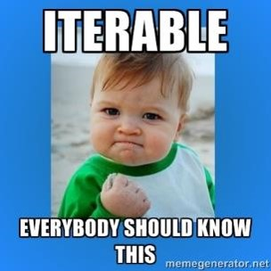

## Iterable

> An iterable is an object capable of returning its members one at a time. That means - you can *iterate over* iterable.

In most cases iterables are lists or tuples, but many other types are also behaving like iterables too. It is even possible to create own classes/objects which will be iterables too if we implement specific magic methods for them.

Let's check what is considered as iterable:

* All sequences!
    * `list`, `tuple`, `str`, `range`
* Non-sequences:
    * `dict`, `set`, `file`

From Python's point of view iterable is an object that has at least one of the following methods:
* `__iter__()` - method returning related iterator
* `__getitem__()` - method to return next item (by key or index)