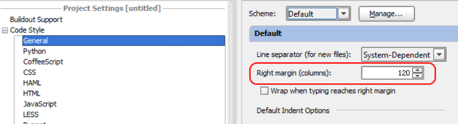

# PEP 8

> PEP = Python Enhancement Proposal

> [**PEP 8**](https://www.python.org/dev/peps/pep-0008/) is Style Guide for Python Code

The code is read much more often than it is written.

We'll cover these main sections:

* Naming conventions
* Blank Lines
* Whitespaces
* Indentation

## Naming conventions

Constants:
* `UPPERCASE_WITH_UNDERSCORES`

Variables – no sctrict rules except:
* `normal_variable`
* `_private_variable`
* `avoiding_conflict_`
* `__magic_method__`
* `__name_mangling`

Functions:
* `lowercase_with_underscores`

Modules:
* `shortalllowercases`
* `long_can_use_underscores_for_readability`

Class:
* `CapWords`

Exceptions:
* `CapWordsError / CapWordsException`

## Blank lines

* Surround top-level function and class definitions with two blank lines.
* Method definitions inside a class are surrounded by a single blank line.
* Extra blank lines may be used (sparingly) to separate groups of related functions. 
* Blank lines may be omitted between a bunch of related oneliners (e.g. a set of dummy implementations).
* Use blank lines in functions, sparingly, to indicate logical sections.

## Imports

Imports should usually be on separate lines

Yes:
```python
import os
import sys
from subprocess import Popen, PIPE
```

No:
```python
import sys, os
```

Imports should be grouped in the following order:
* standard library imports
* related third party imports
* local application/library specific imports

```python
import os
import sys

from django.db import models

from myproject.helpers import text_processing
```

You should put a blank line between each group of imports.

Absolute imports are recommended, as they are usually more readable and tend to be better behaved (or at least give better error messages) if the import system is incorrectly configured (such as when a directory inside a package ends up on sys.path )

```python
import mypkg.sibling
from mypkg import sibling
from mypkg.sibling import example
```

But in some cases - when dealing with complex package layouts where using absolute imports would be unnecessarily verbose:

```python
from . import sibling
from .sibling import example
```

## Whitespaces

Avoid extraneous whitespace in the following situations:
* Immediately after parentheses, brackets or braces.

Yes: `spam(ham[1], {eggs: 2})`

No: `spam  ( ham[ 1 ], { eggs: 2 } )`

* Immediately before a comma, semicolon, or colon:

Yes: `if x == 4: print(x, y); x, y = y, x`

No: `if x == 4 : print(x , y ); x , y = y , x`

* Immediately before the open parenthesis that starts the argument list of a function call:

Yes: `spam(1)`

No: `spam (1)`

* Immediately before the open parenthesis that starts an indexing or slicing:

Yes: `dct['key'] = lst[index]`

No: `dct ['key'] = lst [index]`

* Don't use spaces around the = sign when used to indicate a keyword argument or a default parameter value.

Yes: 
```python
def complex(real, imag=0.0, varz):
    return magic(r=real, i=imag)
```

No:
```python
def complex(real, imag = 0.0, varz):
    return magic(r = real, i = imag)
```

## Indentation

Continuation lines should align wrapped elements either vertically using Python's implicit line joining inside parentheses, brackets and braces, or using a hanging indent

These examples are good:

```python
# Aligned with opening delimiter.
foo = long_function_name(var_one, var_two,
                         var_three, var_four)

# More indentation included to distinguish from the rest
def long_function_name(
        var_one, var_two,
        var_three, var_four):
    print(var_one)
```

```python
# Hanging indents should add a level (may be not 4 spaces)
foo = long_function_name(
    var_one, var_two,
    var_three, var_four)
    
    
d = dict(x=10,
         y=20,
         z=30,
         w=40)
```

NO:

```python
# Arguments on first line forbidden when not using vertical alignment.
foo = long_function_name(var_one, var_two,
var_three, var_four)

foo = long_function_name(var_one, var_two,
    var_three, var_four)

# Further indentation required as indentation is not distinguishable.
def long_function_name(
    print_var_zero, var_two, var_three,
    print_var_one):
    print(var_one)
```

*  Using if:

```python
# No extra indentation. It's correct but ugly
if (this_is_one_thing and
    that_is_another_thing):
    do_something()
```

```python
# Add a comment, which will provide some distinction in editors
# supporting syntax highlighting.
if (this_is_one_thing and
    that_is_another_thing):
    # Since both conditions are true...
    do_something()
    
# Add some extra indentation on the conditional continuation line.
if (this_is_one_thing
        and that_is_another_thing):
    do_something()
```    

## Maximum line length

Limit all lines to a maximum of 79 characters.
* 80 lines vs 120 line = Eternal Holy War
* For flowing long blocks of text with fewer structural restrictions (docstrings or comments), the line length should be limited to 72
characters.

```python
with open('/path/to/some/file/you/want/to/read') as file_1, \
        open('/path/to/some/file/being/written', 'w') as file_2:
    file_2.write(file_1.read())
```

For PyCharm (may be non-actual):

`File >> Settings >> Editor >> Code Style: Right margin (columns)`



The preferred way of wrapping long lines is by using Python's implied line continuation inside parentheses, brackets and braces. If necessary, you can add an extra pair of parentheses around an expression, but sometimes using a backslash looks better.

```python
a = some_function(
    '1' + '2' + 
    '3' + '4'
)

# expression

a = ('1' + '2' +
    '3' + '4')

a = '1' + '2' + \
    '3' + '4'
```

Also:

```python
if (number > 5 and
        number < 15):
    print("1")
    
if number > 5 and \
        number < 15:
    print("1")
```