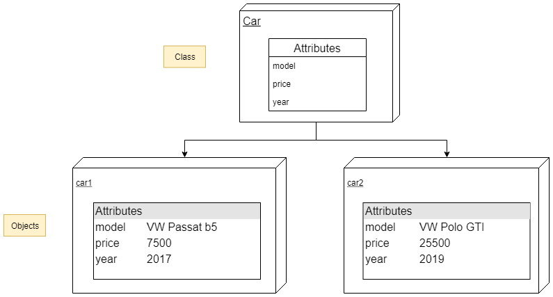

# OOP Basics

> OOP (Object oriented Programming) - programming paradigm where all operations are based on manipulations on abstract objects which has internal state and support methods that query or modify this internal state in some way.

Python’s class mechanism adds classes with a minimum of new syntax and semantics. 

Python classes provide all the standard features of Object Oriented Programming: the class inheritance mechanism allows multiple base classes, a derived class can override any methods of its base class or classes, and a method can call the method of a base class with the same name. Objects can contain arbitrary amounts and kinds of data. As is true for modules, classes partake of the dynamic nature of Python: they are created at runtime, and can be modified further after creation.

## OOP for absolute beginners

* Instance/Object is box with attributes (data)
* Class is the blueprint for this box



## OOP mini glossary


Main OOP terms:

* Classes, objects/instances
* Attributes, Methods
* Instantiation
* Inheritance
* Method overloading and overriding
* Superclass

* **Class**
    * "An idea" of object, some pattern
    * A user-defined prototype for an object that defines a set of attributes that characterize any object of the class.
    * Logical group of data (attributes) and functions (referred to as "methods" when defined within a class)
   
* **Instance**
    * An individual object of a certain class.
    
* **Superclass or base class**
    * A class that acts as a parent to some other class or classes. 


* **Method**:
    * A special kind of function that is defined in a class definition.

* **Inheritance**: 
    * Passing attributes and methods of a parent class to instance or child class

* **Method overloading**: 
    * The assignment of more than one behavior to a particular method
    
* **Method overriding**: 
    * The defining of the method with the same name as in parent class
    

## 4 principles of OOP

* Data Abstraction
* Inheritance
* Encapsulation
* Polymorphism

### Data Abstraction

> Isolation of the "idea" from it's realization.

Data abstraction principle is described as ability to show only the important information and hide the implementation details.

Abstraction is a technique for managing complexity of computer systems. It works by establishing a level of complexity on which a person interacts with the system, suppressing the more complex details below the current level.

Data abstraction can be achieved with:

* *Abstract class*
    * The class that has abstract methods. 

* *Abstract method*
    * The method that declared but not defined. These methods require to be exclusively defined in the subclass prior to the actual use.
    
Thus, the instances of an *abstract class* **cannot be created** as it has *abstract* (incompletely defined) methods. 

The instances of subclass **can be created** because needed methods are implemented.

### Inheritance

> Basing an object or class on another object or class, re-using their implementation.

Inheritance is a way to reuse code of existing objects, or to establish a subtype from an existing object, or both, depending upon programming language support. In classical inheritance where objects are defined by classes, classes can inherit attributes and behavior from pre-existing classes called base classes, superclasses, parent classes or ancestor classes. 

There are different types of inheritance (all are supported by Python):

* *Single inheritance*
    * a subclass has one and only one parent
* *Multiple inheritance*
    * a subclass has multiple parent classes
* *Multilevel inheritance*
    * a subclass has a parent which is inherited from another class
* *Hybrid inheritance*
    * multiple and multilevel inheritance together
* *Hierarchical inheritance*
    * a base class has more than one subclass.

### Encapsulation 

> Providing methods to access some data in order to to either hide that data from direct access or to control that access.

* A language mechanism for restricting direct access to some of the object's components.
    * Not achievable in Python
* A language construct that facilitates the bundling of data with the methods (or other functions) operating on that data.
    * Achievable in Python via descriptors

### Polymorphism

> A single interface for instances of different classes. Subtyping or Duck typing.

Polymorphism means the ability to exist in multiple forms: "one name, many forms". An example:

```python
list().__len__
str().__len__
dict().__len__
```

There are 2 basic types of polymorphism:

* *Overloading*, also called as *static* or *compile-time* polymorphism. 
    * *Method overloading* - redefining a super-class method adding new functionality.


```python
class A:
    def method(self):
        return 1
        
class B(A):
    def method(self):
        print("Old result:", super().method())
        return 2
       
obj = B()
obj.method()
```

<div><span style="display:block; white-space: pre-wrap; padding:16px; background-color: #000; color: #e2e2e2; font-family: Hack, Consolas, Menlo, Mono, monospace; border-left: .25em solid #bc0000; border-radius: 4px;">Old result: 1</span></div>


    2


* *Overridding*, also called as *dynamic* or *runtime* polymorphism. 
    * *Method overriding* - defining a method in a subclass with the same name as in the parent class.


```python
class A:
    def method(self):
        return 1
        
class B(A):
    def method(self):
        return 2
    
obj = B()
obj.method()
```


<div><span style="display:block; white-space: pre-wrap; padding:16px; background-color: #000; color: #e2e2e2; font-family: Hack, Consolas, Menlo, Mono, monospace; border-left: .25em solid #bc0000; border-radius: 4px;">2</span></div>


## [SOLID](https://deviq.com/solid/) principles of Object Oriented Design

* **SRP** – Single Responsibility Principle
* **OCP** – Open/Closed Principle
* **LSP** – Liskov Substitution Principle
* **ISP** – Interface Segregation Principle
* **DIP** – Dependency Inversion Principle

### Don't Repeat Yourself (DRY)

> Not the part of SOLID, but still - very important principle

* Avoid duplicate code by abstracting out things that are common and placing those things in a single location.
* DRY is about having each piece of information and behavior in your system in a single, sensible place.

### Single Responsibility Principle

Every object in your system should have a single responsibility, and all the object's services should be focused on carrying out that single responsibility.

### Open-Closed Principle

Classes should be open for extension, and closed for modification.