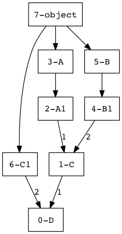
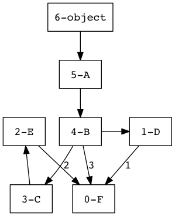

# Method Resolution Order

For old class it was vertical-then-horizontal order of looking up for object attributes/methods.

> For Python 3.x and for New style classes (Python 2.5+) MRO is horizontal-then-vertical order.

## Old style class MRO

> Just for information!

```python
class A: 
    x = 'from A'

class B(A): 
    pass

class C(A): 
    x = 'from C'

class D(B, C): 
    pass
```

```python
print(D.x)
'from A'
```

So as you can see value of C.x is ignored even if it is "closer". This was completely redesigned.

The old MRO builds a list of classes to search for methods. This algorithm is a tree routing:

> Deep first, from left to right

1. Look if method exists in instance class
2. If not, looks if it exists in its first parent, then in the parent of the parent and so on
3. If not, it looks if current class inherits from others classes up to the current instance others parents.

## New style class MRO

The problem with old style classes is that if we going to inherit from base `object` we wouldn't be able to change anything. All because the logic of searching was too simple and wasn't designed for the case where everything is inherited from `object`.


```python
class A:  # class A(object):   <--- in Python 2.5+
    x = 'from A'

class B(A):
    pass
    
class C(A): 
    x = 'from C'

class D(B, C):
    pass
     
print(D.x)
print(D.__mro__)
print(D.mro())
```

    from C
    (<class '__main__.D'>, <class '__main__.B'>, <class '__main__.C'>, <class '__main__.A'>, <class 'object'>)
    [<class '__main__.D'>, <class '__main__.B'>, <class '__main__.C'>, <class '__main__.A'>, <class 'object'>]


Difference to old MRO is the additional check done each time before adding some class to the search path. The check is:

* Is this class is the parent for some other class in the search path that will be added soon?

If **yes** &rarr; then it is been shifted after it's inherited class *in order to not shadow it's methods*.

This new algorithm (used by default in Python 3 and in Python 2 - from 2.2 when subclassing `object`) is called [C3-linearization](https://en.wikipedia.org/wiki/C3_linearization) in case of multiple inheritance to build an order of inheritance hierarchy in which it will search for matching method/attribute.

It can be described in one sentence as:

> Deep first, from left to right with additional check and shifting the class that is parent for next classes after them.

The result of MRO linearization is stored in attribute `__mro__`.


```python
print(D.__mro__) # D.mro()
```

    (<class '__main__.D'>, <class '__main__.B'>, <class '__main__.C'>, <class '__main__.A'>, <class 'object'>)


So, Python 2 would build this MRO:

```D, B, A, C, A```

We see that `A` is repeated, so removing first one keeping the last one will be Python 3's MRO:

```D, B, C, A```


```python
class A(object): 
    x = 1
class B(): pass
class A1(A): pass
class B1(B):
    x = 2
class C(A1, B1): pass
class C1: pass
class D(C, C1): pass

#C.__mro__
D.mro()
```


    [__main__.D,
     __main__.C,
     __main__.A1,
     __main__.A,
     __main__.B1,
     __main__.B,
     __main__.C1,
     object]





```python
class A: pass
class B(A): pass
class C(B): pass
class D(B): pass
class E(C): pass
class F(D, E, B): pass

print(F.__mro__) 
```

    (<class '__main__.F'>, <class '__main__.D'>, <class '__main__.E'>, <class '__main__.C'>, <class '__main__.B'>, <class '__main__.A'>, <class 'object'>)




What's important to know about C3 is that it guarantees three important features:

* Subclasses appear before base classes
* Base class declaration order is preserved
* For all classes in an inheritance graph, the relative orderings guaranteed by 1 and 2 are preserved at all points in the graph.

### Caveats

Sometimes the MRO can not be built:

Another example where `object` is used before the class which inherites from it which confuses the logic:


```python
class A: pass
class B(object, A): pass
```


    

    TypeErrorTraceback (most recent call last)

    <ipython-input-2-4dd56a4b1e0f> in <module>
          1 class A: pass
    ----> 2 class B(object, A): pass
    

    TypeError: Cannot create a consistent method resolution
    order (MRO) for bases object, A