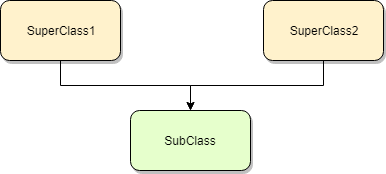

# Super

`super()`

> This function gives you access to methods in a superclass from the subclass that inherits from it.



* Return a proxy/temporary object that allows to call superclass’s methods.
* This is useful for accessing inherited methods that have been overridden in a class. The search order is same as that used by `getattr()` except that the type itself is skipped. 

## Usage of `super()`

But first of all let's check what is bound/unbound method

> Method bound to the object is the function that passes that object as the first argument (instance for instance methods, class for class methods).

```python
a = A()
a.method(x) --> A.method(a, x)  # <-- here a.method is bound method
```

> "bound_method is bound method :)

`super()` will return **bound method** depends from context. So for method like `__new__` (which has class as first argument it will return unbound class method).

In the following example notice that we pass `cls` in `__new__()` but in `__init__` we don't pass `self`. This is because in case of `__init__` this method is bound to `self` instance already.

### Usage of super() with different types of methods

Please notice that we don't pass `cls`/`self` into class/instance methods:


```python
class A:
    attr = "class attr from A"

    def instance_method(self):
        print("Running method of A")
        return self.attr

    @classmethod
    def class_method(cls):
        return cls.attr

    @staticmethod
    def static_method():
        return "Some static data (from A class)"


class C:
    def instance_method(self):
        return "I AM FROM C"


class B(A, C):
    attr = "class attr from B"
    
    def instance_method(self):
        print("Running instance method in B...")
        #return A.instance_method(self)
        return super().instance_method()   # FROM A (next in MRO)
        # return super(B, self).instance_method()   # FROM A (next in MRO)
        #return super(A, self).instance_method()  # FROM C (after A)

    @classmethod
    def class_method(cls):
        print("Running class method in B...")
        # print(f"!!! {A.class_method()}")
        return super().class_method()

    def __new__(cls):
        print("Running __new__...")
        return super().__new__(cls)

    @staticmethod
    def static_method():  # Super difficult
        print("Running static method...")
        #return super(B, B).static_method()
        return A.static_method()

# Working with class A (original, super-class)
a = A()
a.attr = "Object's own attr (from class A)"
print(a.__dict__)
print(a.instance_method())
print(a.class_method())
# print(A.static_method())
print("--------" * 10)

# Working with class B (child to A and C)
b = B()
print(B.mro())
b.attr = "Object's own attr (from class B)"
print(b.instance_method())
print(b.class_method())
print(b.static_method())
```

<pre class="notranslate" style="display:block; white-space: pre-wrap; padding:16px; background-color: #000;color: #e2e2e2;font-family: Hack, Consolas, Menlo, Mono, monospace;border-left: .25em solid #bc0000;"><code>{'attr': "Object's own attr (from class A)"}
    Running method of A
    Object's own attr (from class A)
    class attr from A
    --------------------------------------------------------------------------------
    Running __new__...
    [<class '__main__.B'>, <class '__main__.A'>, <class '__main__.C'>, <class 'object'>]
    Running instance method in B...
    Running method of A
    Object's own attr (from class B)
    Running class method in B...
    class attr from B
    Running static method...
    Some static data (from A class)</code></pre>


### More examples:

#### Base class abstraction

The dict that checks for int/str version of the key if it exists:


```python
class FlexibleDict(dict):
    def __getitem__(self, key):
        try:
            if key in self:
                pass
            elif str(key) in self:
                key = str(key)
            elif int(key) in self:
                key = int(key)
        except ValueError:
            pass
            
        return dict.__getitem__(self, key)

fd = FlexibleDict()
fd[1] = 100500
print(fd["1"])
```

<pre class="notranslate" style="display:block; white-space: pre-wrap; padding:16px; background-color: #000;color: #e2e2e2;font-family: Hack, Consolas, Menlo, Mono, monospace;border-left: .25em solid #bc0000;"><code>100500</code></pre>


The dict with logging around setting a key:


```python
class VerboseDict(dict):
    def __setitem__(self, key, value):
        print(f'Set: {key} -> {value}')
        super().__setitem__(key, value)
        
vd = VerboseDict(x=1, y=2)
vd["z"] = "!"
vd[1] = 100500
vd
```


```python
from collections import defaultdict

class VerboseDict(defaultdict):  # new base class
    def __setitem__(self, key, value):
        print(f'Set: {key} -> {value}')
        super().__setitem__(key, value)  # no change needed

vd = VerboseDict(int, x=1, y=2)
vd["z"] = 3
vd[100] = 100500
vd[5]
vd
```

<pre class="notranslate" style="display:block; white-space: pre-wrap; padding:16px; background-color: #000;color: #e2e2e2;font-family: Hack, Consolas, Menlo, Mono, monospace;border-left: .25em solid #bc0000;"><code>Set: z -> 3
    Set: 100 -> 100500
    Set: 5 -> 0</code></pre>


    VerboseDict(int, {'x': 1, 'y': 2, 'z': 3, 100: 100500, 5: 0})


#### Extending class, multi-inheritance


```python
from collections import Counter

class VerboseDict(dict):
    def __setitem__(self, key, value):
        print(f'Set: {key} -> {value}')
        super().__setitem__(key, value)

class VerboseCounter(VerboseDict, Counter):
    pass

# This will use __setitem__ from Counter instead of dict
print(f'MRO for VerboseCounter is: {VerboseCounter.mro()}')
counter = VerboseCounter("boombbbam")
print(counter)
```

<pre class="notranslate" style="display:block; white-space: pre-wrap; padding:16px; background-color: #000;color: #e2e2e2;font-family: Hack, Consolas, Menlo, Mono, monospace;border-left: .25em solid #bc0000;"><code>MRO for VerboseCounter is: [<class '__main__.VerboseCounter'>, <class '__main__.VerboseDict'>, <class 'collections.Counter'>, <class 'dict'>, <class 'object'>]
    Set: b -> 1
    Set: o -> 1
    Set: o -> 2
    Set: m -> 1
    Set: b -> 2
    Set: b -> 3
    Set: b -> 4
    Set: a -> 1
    Set: m -> 2
    VerboseCounter({'b': 4, 'o': 2, 'm': 2, 'a': 1})</code></pre>


#### Extending list

> This is an example useful to testing.

But in case you want to overload `__new__` method please remember that it is static method so you need to pass `cls`:


```python
from collections import UserList

class SuperList(list):
    def __new__(cls, data=None, *args):
        result = super().__new__(cls)
        result.append("START")
        if data:
            result.extend(reversed(data))
        result.append("STOP")
        print("Before __init__:", result)
        return result
    
    def __init__(self, data=None, *args):
        'hiding list.__init__ which is resets the list'
#         if data:
#             self.extend(reversed(data))
#         self.append("STOP")
        pass
    
print(SuperList())
print(SuperList("abcde"))
```

<pre class="notranslate" style="display:block; white-space: pre-wrap; padding:16px; background-color: #000;color: #e2e2e2;font-family: Hack, Consolas, Menlo, Mono, monospace;border-left: .25em solid #bc0000;"><code>Before __init__: ['START', 'STOP']
    ['START', 'STOP']
    Before __init__: ['START', 'e', 'd', 'c', 'b', 'a', 'STOP']
    ['START', 'e', 'd', 'c', 'b', 'a', 'STOP']</code></pre>


There is also bigger example for this with lot of print() calls to see where exactly we are at each moment. Please use it to practice and to dig into this a bit more.

We can clearly see that firstly we call `__new__` and after that `__init__`


```python
class SuperList(list):
    def __new__(cls, *args, **kwargs):
        print(">>> Use parent's constructor but print this line!")
        original_list = super().__new__(cls, *args, **kwargs)
        print(">>> Original list:", original_list)
        print(id(original_list))
        return original_list
    
    def __init__(self, *args, **kwargs):
        print(">>> Before running old __init__:", self)
        super().__init__(*args, **kwargs)
        print(">>> After running old __init__:", self)
        self.append("last element!")
        
l = SuperList("abcde")
print(type(l))
print("New 'list':", l)
l[0] = 100
del l[1]
l[3:5] = ["AAA", "BBB"]
print("After changes:", l)
print(id(l))
```

<pre class="notranslate" style="display:block; white-space: pre-wrap; padding:16px; background-color: #000;color: #e2e2e2;font-family: Hack, Consolas, Menlo, Mono, monospace;border-left: .25em solid #bc0000;"><code>>>> Use parent's constructor but print this line!
    >>> Original list: []
    140690636702248
    >>> Before running old __init__: []
    >>> After running old __init__: ['a', 'b', 'c', 'd', 'e']
    <class '__main__.SuperList'>
    New 'list': ['a', 'b', 'c', 'd', 'e', 'last element!']
    After changes: [100, 'c', 'd', 'AAA', 'BBB']
    140690636702248</code></pre>


### `super()` based on another class

As resume - we see that super() uses the MRO of passed class (by default it is the class we are defining method for). That's why if we pass another class directly (like it was in Python 2) it will use MRO of that class:


```python
class A: 
    def m(self):
        return "A"
    
class B(A):
    def m(self):
        return "B"
    
class C(B):
    def m(self):
        return "C"
    
class D(C):
    def m(self):
        print(f"default super()'s MRO is {self.__class__.mro()}")
        print(f"super().m() -> {super().m()} (we take <m> from <C>)")
        print("~" * 60)
        print(f"B's MRO is {B.mro()}")
        print(f"super(B, self).m() -> {super(B, self).m()} (we take <m> from <A>)")
D().m()
```

<pre class="notranslate" style="display:block; white-space: pre-wrap; padding:16px; background-color: #000;color: #e2e2e2;font-family: Hack, Consolas, Menlo, Mono, monospace;border-left: .25em solid #bc0000;"><code>default super()'s MRO is [<class '__main__.D'>, <class '__main__.C'>, <class '__main__.B'>, <class '__main__.A'>, <class 'object'>]
    super().m() -> C (we take <m> from <C>)
    ~~~~~~~~~~~~~~~~~~~~~~~~~~~~~~~~~~~~~~~~~~~~~~~~~~~~~~~~~~~~
    B's MRO is [<class '__main__.B'>, <class '__main__.A'>, <class 'object'>]
    super(B, self).m() -> A (we take <m> from <A>)</code></pre>


More examples:


```python
class A1:
    attr = 1
class A2:
    attr = 2
class A3:
    attr = 3

class AResult(A1, A2, A3):    
    def __call__(self):       
        return super().attr   
AResult()()
```


<pre class="notranslate" style="display:block; white-space: pre-wrap; padding:16px; background-color: #000;color: #e2e2e2;font-family: Hack, Consolas, Menlo, Mono, monospace;border-left: .25em solid #bc0000;"><code>1</code></pre>


The same as `super()`:


```python
class AResult(A1, A2, A3):
    def __call__(self):
        return super(self.__class__, self).attr
AResult()()
```


    1


To start FROM A2:


```python
class AResult(A1, A2, A3):
    def __call__(self):
        return super(A1, self).attr
AResult()()
```


    2


```python
class AResult(A1, A2, A3):
    def __call__(self):
        return super(A2, self).attr
AResult()()
```


    3


### Simple `super(cls, obj)` implementation


```python
class super:                                         
    def __init__(self, *args, **kwargs):             
        print(args)                                  
        self.start_cls, self.instance = args         
                                                     
    def __getattr__(self, attr):                     
        print(f"Running __getattr__, attr = {attr}") 
        start = False                                
        for cls in self.instance.__class__.mro():    
            if not start and cls != self.start_cls:  
                continue                             
            if cls == self.start_cls:                
                start = True                         
                continue                             
            if hasattr(cls, attr):                   
                ret = getattr(cls, attr)             
                if callable(ret):                    
                    return lambda: ret(self.instance)
                return ret                           

```


```python
class A:
    def m(self):                                     
        return "A"
    
class B:
    def m(self):                                     
        return "B"
    
class C:
    def m(self):                                     
        return "C"

class D(A, B, C):                                    
    def m(self):                                     
        return super(B, self).m()                    

print(D.mro())                                       
D().m()
```

    [<class '__main__.D'>, <class '__main__.A'>, <class '__main__.B'>, <class '__main__.C'>, <class 'object'>]
    (<class '__main__.B'>, <__main__.D object at 0x7f4245717dd8>)
    Running __getattr__, attr = m


    'C'