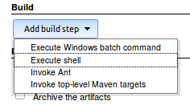
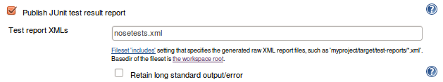
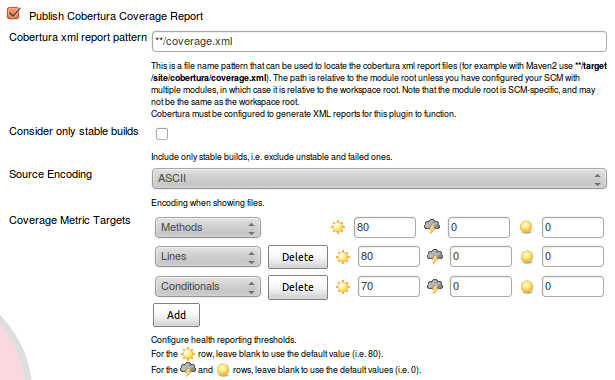
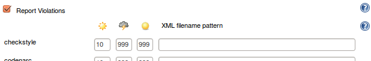
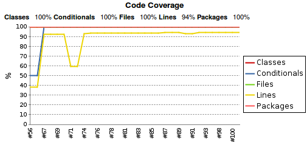

# Continuous integration

> In software engineering, continuous integration (CI) is the practice of merging all developers' working copies to a shared mainline several times a day.

In practice, CI is a tool that:
* monitors code repository
* in case of changes it:
    * fetches recent version
    * builds it
    * runs defined tests
    * in case of fail - notifies the author of the changes and/or other defined users
    * publish results, build graphs, statistics etc.

Popular CIs:

* [Jenkins](https://jenkins.io/) / Hudson (old name)
* [Atlassian Bamboo](https://www.atlassian.com/software/bamboo)
* [Microsoft Team Foundation Server](https://visualstudio.microsoft.com/tfs/)
* [CruiseControl](http://cruisecontrol.sourceforge.net/)


## Jenkins

> [Jenkins](https://jenkins.io/) is a self-contained, open source automation server which can be used to automate all sorts of tasks related to building, testing, and delivering or deploying software.

#### Three main features:
* Auto start of tests
* Reporting
* Plugins for different SVC, publishing, authenticating etc.

Auto start of tests
+ schedule
+ by commit
+ by configurable event
+ manually

Reports:
* JUnit parsing
* draw graphics
* keep history of all builds, dynamics
* store time of runs

Reporting is based on these nosetests options (Junit and coverage) and pylint (PEP8 style check):

* `pytest  --junit-xml=results.xml`
* `nosetests --with-xunit --with-xcoverage`
* `pylint -f parseable myapp/ | tee pylint.out`

#### Installation

Jenkins can be installed through native system packages, Docker, or even run standalone by any machine with a Java Runtime Environment (JRE) installed.

1. We can download standalone `jenkins.war` and run it (to install/run Jenkins):

```sh
java -jar jenkins.war
```
or use docker:

```sh
docker run -p 8080:8080 -p 50000:50000 --name jenkins -v JENKINS:/var/jenkins_home jenkins/jenkins
```

2. Upon first run it will tell admin pass (and also it will be stored at `~/.jenkins/secrets/initialAdminPassword`):

```
Jenkins initial setup is required. An admin user has been created and a password generated. Please use the following password to proceed to installation:

8f1947428ee94a3ba577078e2107c0a3
```

3. To use it user should proceed to Jenkins web app which us by default at `http://localhost:8080` and enter the password mentioned above.

4. It will ask which plugins to install. These additional plugins can be chosen at this point (specified with correspondent sections):

    * Source Code Management:
        * Git, GitHub, BitBucket
    * Build Analysis and Reporting:
        * JUnit, Cobertura, Violations
    * Notifications and Publishing:
        * SSH
        
After this - "Install". This will take some time to fetch and installed selected plugins.

5. Create user (or continue using `admin`), setup network `address:port`
6. `Save and Finish` to start working with Jenkins.

### Basic Jenkins job

Workflow is similar to the following one:

1. Create new job
2. Add source (GIT, SVN, P4)
3. Add script for the automated task to run (setup/build/test)
4. Process results, generate reports
5. Running


### 1. Create new Job


1. "Create new Item"
2. Enter name
3. Select type: "Freestyle Project"
4. Add description

### 2. Source Code Management


1. At "Source Code Management" section choose needed SVC - Git, Mercurial, Subversion, etc.
2. Enter details - like URL, credentials
    * Example: for local git enter: `file:///home/devuser/projects/someproject` or `file:///D/py_training_zone/tests`
3. At "Build Triggers" select needed behaviour:
    * Trigger builds remotely (e.g., from scripts)
        * Some script should request `JENKINS_URL/job/<JOB_NAME>/build?token=<TOKEN>` to run <JOB_NAME> (<TOKEN> is customizable)
    * Build periodically
    * GitHub hook trigger
    * Poll SCM
        * Jenkins can periodically check are there any changes in SVC

### 3. Script

In this section we should enter a script to run each time

1. At "Build Environment" section we may want this option:
    * Delete workspace before build starts
    * Add timestamps to the Console Output
2. At "Build" section we need to add a new build step:
    * "Execute shell"



The idea of the script we need to run is the following:

* Setup virtual environment (to not mess with system libs and other test jobs)
* Install required python packages
* Run tests (`myapp` is the name of the main package - for coverage and pylint tests)

**Note**: the list of available env variables (like `WORKSPACE`, `GIT_COMMITTER_NAME` and `BUILD_DISPLAY_NAME`) can be viewed at `<JENKINS_URL>/env-vars.html/`

```sh
PYENV_HOME=$WORKSPACE/.pyenv/

# Delete previously built virtualenv
if [ -d $PYENV_HOME ]; then
    rm -rf $PYENV_HOME
fi

# Create virtualenv and install necessary packages
virtualenv --no-site-packages $PYENV_HOME

# Unix: 
. $PYENV_HOME/bin/activate
# Windows: #$PYENV_HOME\Scripts\activate

pip install --quiet nose nosexcover
pip install --quiet pylint

# Installed project requirements:
pip install -r requirements.txt

# Run tests
nosetests --with-xunit --with-xcoverage --cover-package=myapp --cover-erase
pylint myapp.py | tee pylint.out
```

### 4. Reporting

When nose runs, it will generate report files in your workspace that Jenkins has to interpret.

* `nosetests.xml`: This file is generated by the `--with-xunit` option and can be interpreted by checking "Publish JUnit test result report"



* `coverage.xml`: The coverage file is generated by `--with-xcoverage`. Jenkins can interpret this report after installing the Cobertura plugin. It will be available as "Publish Cobertura Coverage Report", and the report pattern must be **/coverage.xml.



* `pylint.out`: For this one, you have to install the Violations plugin, which will make the checkbox "Report Violations" available. The plugin supports a bunch of different reports. Look for `"pylint"` and enter `**/pylint.out` as the "XML filename pattern".



### 5. Running

Run "Build Now" and tweak the Shell script until nose runs all the way through (regardless if your tests pass). Make sure the report files are generated. Eventually, you will get nice charts on your job's page.

We can see live output in `Job > Build #... > Console Output`




### Additional tricks

#### GitHub hook

As an example here we'll se how to install GitHub hook so every time Github project receives new code (push) it will send a signal to Jenkins to start a job. 

Let's have Jenkins ready to receive notifications from Github. We need to check "Trigger builds remotely (e.g., from scripts)".


Once enabled, set the "Authentication Token" to, e.g., `GIT_PUSH_NOTIFY`.

Now go to your Github project page, click the "Admin" button to configure a "Post-Receive URLs" service hook, and copy/paste the URL given under the "Authentication Token" input field.


Finally replace, the `JENKINS_URL` part by the URL to your own Jenkins server. Github has a "Test hook" button to simulate a code push and trigger an actual HTTP call. Jenkins should start building your Python project automatica