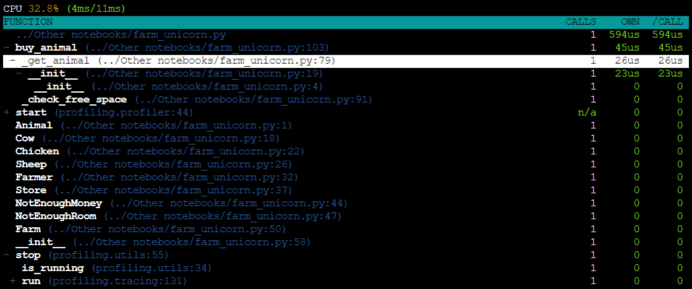
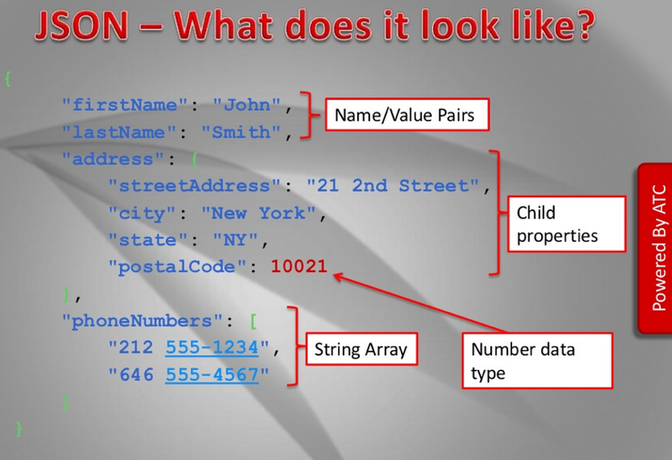

## Additional CLI libraries

* [Arguments parsing](#Arguments-parsing)
    * [argparse](#argparse)
    * [docopt](#docopt)
    * [click](#click)
    * [fire](#fire)
* [tqdm](#tqdm)
* [Colorama](#Colorama)
* [Yaspin](#Yaspin)
* [Pendulum](#Pendulum)
* [Loguru](#Loguru)
* [ConfigObj](#ConfigObj)
* [Requests](#Requests)
* [JSON](#JSON)
* [xmltodict](#xmltodict)


### Arguments parsing

* [This article](https://realpython.com/comparing-python-command-line-parsing-libraries-argparse-docopt-click/) shows how to use and differences of the following top argument parsing libs:
    * [argparse](https://docs.python.org/3/library/argparse.html)
    * [docopt](http://docopt.org/)
    * [click](https://click.palletsprojects.com/en/7.x/)
    * [fire](https://github.com/google/python-fire)

####   [argparse](https://docs.python.org/3/library/argparse.html)

```python
import argparse

def hello(args):
    print('Hello, {0}!'.format(args.name))


def goodbye(args):
    print('Goodbye, {0}!'.format(args.name))

parser = argparse.ArgumentParser()
subparsers = parser.add_subparsers()

hello_parser = subparsers.add_parser('hello')
hello_parser.add_argument('name')  # add the name argument
hello_parser.set_defaults(func=hello)  # set the default function to hello

goodbye_parser = subparsers.add_parser('goodbye')
goodbye_parser.add_argument('name')
goodbye_parser.set_defaults(func=goodbye)

if __name__ == '__main__':
    args = parser.parse_args()
    args.func(args)  # call the default function
```

```sh
$ python argparse_test.py hello Johnny
Hello, Johnny!

$ python argparse_test.py hello --help
usage: argparse_test.py hello [-h] name

positional arguments:
  name

optional arguments:
  -h, --help  show this help message and exit

```

####  [docopt](http://docopt.org/)

```python
"""
Usage:
  docopt_test.py hello <name>
  docopt_test.py goodbye <name>
  docopt_test.py (-h | --help)
"""

from docopt import docopt

def hello(name):
    print('Hello, {0}!'.format(name))

def goodbye(name):
    print('Goodbye, {0}'.format(name))

if __name__ == '__main__':
    arguments = docopt(__doc__)

    # if an argument called hello was passed, execute the hello logic.
    if arguments['hello']:
        hello(arguments['<name>'])
    elif arguments['goodbye']:
        goodbye(arguments['<name>'])
```

```sh
$ python docopt_test.py hello Johnny
Hello, Johnny!

$ python docopt_test.py hello --help
Greeter.

Usage:
  docopt_test.py hello <name>
  docopt_test.py goodbye <name>
  docopt_test.py (-h | --help)

Options:
  -h --help     Show this screen.
```

####   [click](https://click.palletsprojects.com/en/7.x/)

```python
import click

@click.group()
def greet():
    pass

@greet.command()
@click.argument('name')  # add the name argument
def hello(name):
    print(f'Hello, {name}!')

@greet.command()
@click.argument('name')
def goodbye(**kwargs):
    print(f'Goodbye, {kwargs["name"]}!')

if __name__ == '__main__':
    greet()
```

```sh
$ python click_test.py hello Johnny
Hello, Johnny!

$ python click_test.py hello --help
Usage: click_test.py hello [OPTIONS] NAME

Options:
  --help  Show this message and exit.
```

#### [fire](https://github.com/google/python-fire)


```python
import fire


def hello(name):
  return f"Hello, {name}!"

if __name__ == '__main__':
  fire.Fire(hello)
```

```sh
$ python fire_test.py Johnny
Hello, Johnny!

$ python fire_test.py --help
INFO: Showing help with the command 'fire_test.py -- --help'.

NAME
    fire_test.py

SYNOPSIS
    fire_test.py NAME

POSITIONAL ARGUMENTS
    NAME

NOTES
    You can also use flags syntax for POSITIONAL ARGUMENTS
```

### pick

* `pick`
    * Command line menu mini framework
    
Installation:

```shell
pip install pick
```

Example:

```python
from pick import pick

title = 'Please choose your favorite programming language: '
options = ['Java', 'JavaScript', 'Python', 'PHP', 'C++', 'Erlang', 'Haskell']
option, index = pick(options, title)
print(option)
```

produces this:


### tqdm

* [`tqdm`](https://github.com/tqdm/tqdm)
    * Command line progress bar framework


```python
from tqdm import tqdm
l = []
for i in tqdm(range(10000)):
    l.append(i ** i)
```

<div><pre style="background-color: #000;color: #e2e2e2;font-family: Hack, Consolas, Menlo, Mono, monospace;border-left: .25em solid #bc0000;"><code>100%|██████████| 10000/10000 [00:11<00:00, 902.17it/s] </code></pre></div>


### Colorama

* [Colorama](https://github.com/tartley/colorama)
    * Simple cross-platform colored terminal text in Python

> Makes ANSI escape character sequences (for producing colored terminal text and cursor positioning) work under MS Windows.
>
> Colorama also provides some shortcuts to help generate ANSI sequences but works fine in conjunction with any other ANSI sequence generation library, such as the venerable Termcolor (https://pypi.org/project/termcolor/) or the fabulous Blessings (https://pypi.org/project/blessings/).

Possible color formattings:

  


```python
from colorama import Fore, Back, Style
print(Fore.YELLOW + Back.BLUE + 'some yellow text')
print(Back.GREEN + 'and with a green background')
print("Test..")
print(Back.RED + Style.DIM + 'and in dim text') # Check in console...
print(Style.RESET_ALL)
print('back to normal now')
```

<div><pre style="background-color: #000;color: #e2e2e2;font-family: Hack, Consolas, Menlo, Mono, monospace;border-left: .25em solid #bc0000;"><code>some yellow text
    and with a green background
    Test..
    and in dim text
    
    back to normal now</code></pre></div>


### Yaspin

* [yaspin](https://github.com/pavdmyt/yaspin)
    * Yet Another Terminal Spinner for Python
    
```python
import time
from random import randint
from yaspin import yaspin

with yaspin(text="Loading", color="yellow") as spinner:
    time.sleep(2)  # time consuming code

    success = randint(0, 1)
    if success:
        spinner.ok("✅ ")
    else:
        spinner.fail("💥 ")
```


### Pendulum

* [Pendulum](https://github.com/sdispater/pendulum)
    * Python datetimes made easy.


```python
import pendulum

now_in_kiev = pendulum.now('Europe/Kiev') # <-- Sorry for incorrect spelling :(
now_in_kiev
```


<div><pre style="background-color: #000;color: #e2e2e2;font-family: Hack, Consolas, Menlo, Mono, monospace;border-left: .25em solid #bc0000;"><code>DateTime(2020, 9, 4, 13, 23, 7, 728239, tzinfo=Timezone('Europe/Kiev'))</code></pre></div>


```python
len(pendulum.timezones)
```


<div><pre style="background-color: #000;color: #e2e2e2;font-family: Hack, Consolas, Menlo, Mono, monospace;border-left: .25em solid #bc0000;"><code>592</code></pre></div>


We can parse datetime from a string:


```python
print(pendulum.parse("2020/11/05"))
print(pendulum.parse('20160413'))
```

<div><pre style="background-color: #000;color: #e2e2e2;font-family: Hack, Consolas, Menlo, Mono, monospace;border-left: .25em solid #bc0000;"><code>2020-11-05T00:00:00+00:00
    2016-04-13T00:00:00+00:00</code></pre></div>


```python
print(pendulum.from_format('01, 05, 2020', 'D, MM, YYYY'))
print(pendulum.from_format('2018-1-17', 'YYYY-M-DD'))
```

<div><pre style="background-color: #000;color: #e2e2e2;font-family: Hack, Consolas, Menlo, Mono, monospace;border-left: .25em solid #bc0000;"><code>2020-05-01T00:00:00+00:00
    2018-01-17T00:00:00+00:00</code></pre></div>


```python
# Seamless timezone switching
now_in_kiev.in_timezone('UTC')
```


<div><pre style="background-color: #000;color: #e2e2e2;font-family: Hack, Consolas, Menlo, Mono, monospace;border-left: .25em solid #bc0000;"><code>DateTime(2020, 9, 4, 10, 23, 7, 728239, tzinfo=Timezone('UTC'))</code></pre></div>


```python
tomorrow = pendulum.now().add(days=1)
last_week = pendulum.now().subtract(weeks=1)

print(pendulum.now().subtract(days=3, hours=23, minutes=55, seconds=1).diff_for_humans())
print(pendulum.now().subtract(minutes=65, seconds=1).diff_for_humans())
print(pendulum.now().subtract(seconds=7).diff_for_humans())
```

<div><pre style="background-color: #000;color: #e2e2e2;font-family: Hack, Consolas, Menlo, Mono, monospace;border-left: .25em solid #bc0000;"><code>4 days ago
    1 hour ago
    a few seconds ago</code></pre></div>


```python
delta = tomorrow - last_week
print(f"In hours: {delta.hours}")

print(delta.in_words(locale='en'))
print(delta.in_words(locale='ru')) # <-- Only "ru" at the moment, no "ua" :(
```

    In hours: 23
    1 week 23 hours 59 minutes 59 seconds
    1 неделя 23 часа 59 минут 59 секунд


### Loguru

* [Loguru](https://github.com/Delgan/loguru)
    * A library which aims to bring enjoyable logging in Python.


```python
from loguru import logger

logger.debug("That's it, beautiful and simple logging!")
```

    2019-09-20 13:08:41.340 | DEBUG    | __main__:<module>:3 - That's it, beautiful and simple logging!


```python
import sys

# How to add a handler? How to set up logs formatting? How to filter messages? How to set level?
# One answer: the add() function.
logger.add(sys.stderr, format="{time} {level} {message}", filter="my_module", level="INFO")

# Pretty formatting
logger.add(sys.stdout, colorize=True, format="<green>{time}</green> <level>{message}</level>")

logger.debug("Check it now!")
```

    2019-09-20 13:09:10.415 | DEBUG    | __main__:<module>:10 - Check it now!


    2019-09-20T13:09:10.415490+0000 Check it now!


The code
```python
logger.add("output.log", backtrace=True, diagnose=True)  # Set 'False' to not leak sensitive data in prod

def func(a, b):
    return a / b

def nested(c):
    try:
        func(5, c)
    except ZeroDivisionError:
        logger.exception("What?!")

nested(0)
```
will result in the following traceback debug log message:

```shell
2018-07-17 01:38:43.975 | ERROR    | __main__:nested:10 - What?!
Traceback (most recent call last):

  File "test.py", line 12, in <module>
    nested(0)
    └ <function nested at 0x7f5c755322f0>

> File "test.py", line 8, in nested
    func(5, c)
    │       └ 0
    └ <function func at 0x7f5c79fc2e18>

  File "test.py", line 4, in func
    return a / b
           │   └ 0
           └ 5

ZeroDivisionError: division by zero
```

### ConfigObj

* [ConfigObj](https://github.com/DiffSK/configobj)
    * Python 3+ compatible port of the configobj library.
   
[ConfigObj](http://configobj.readthedocs.io) allows the program to be able read setting from a file like the following one:

```ini
debug = True
version = 0.1
services = ui, web, db

[logging]
log_level = INFO
log_file = /tmp/example.log
```

and use it like this:

```python
from configobj import ConfigObj

config = ConfigObj("config.ini")

print(config['version'])   # 0.1
print(config['services'])  # ["ui", "web", "db"]
with open(config['logging']['log_file'] as f:
    f.write(log_msg)
```

> ConfigObj is a simple but powerful config file reader and writer: an ini file round tripper. Its main feature is that it is very easy to use, with a straightforward programmer’s interface and a simple syntax for config files. It has lots of other features though :

* Nested sections (subsections), to any level
* List values
* Multiple line values
* String interpolation (substitution)
* Validation

Install as usual:

```sh
pip install configobj
```

#### Reading config


```python
# As example let's read ini from "virtual" file:
import io

ini_contents = '''
debug = True
version = 0.1
services = ui, web, db, logging, web services

[logging]
log_level = INFO
log_file = /tmp/example.log
''' 

f = io.StringIO(ini_contents)  # File-like object
```


```python
from configobj import ConfigObj

# Usually:
# config = ConfigObj("config.ini") 

config = ConfigObj(f)
 
print(config['version'])  # 0.1
print(config['debug'])  # True
print(config['services'])  # ["ui", "web", "db"]
print(config['logging']['log_file'])
```

    0.1
    True
    ['ui', 'web', 'db', 'logging', 'web services']
    /tmp/example.log


#### Validating

This powerful feature allows to validate provided ini file before parsing and using it. 

Validation is done with the help of `Validator` object and `configspec` (which resembles your config file, with a check for every member). Basic checks:

* boolean values (True and False)
* integers (including minimum and maximum values)
* floats (including min and max)
* strings (including min and max length)
* IP addresses (v4 only)


Example of configspec:

```python
port = integer(0, 100)
user = string(max=25)
mode = option('quiet', 'loud', 'silent')
mode2 = option('quiet', 'loud', 'silent', default='loud')
nick = string(default=None)
```

### Profiling

> The profiling package is an interactive continuous Python profiler. It is inspired from Unity 3D profiler. This package provides these features:

```python
> pip install profiling
```

* Profiling statistics keep the frame stack.
* An interactive TUI profiling statistics viewer.
* Provides both of statistical and deterministic profiling.
* Utilities for remote profiling.
* Thread or greenlet aware CPU timer.
* Supports Python `2.7`, `3.3`, `3.4` and `3.5`.
* **Currently supports only Linux.**

```sh
> profiling farm_unicorn.py
```



# Requests


> [Requests](https://requests.readthedocs.io/en/master/) is the only Non-GMO HTTP library for Python, safe for human consumption

> __Warning__: Recreational use of other HTTP libraries may result in dangerous side-effects, including: security vulnerabilities, verbose code, reinventing the wheel, constantly reading documentation, depression, headaches, or even death.

Code to fetch a page without using `requests`

```py
# Python 2
import urllib2

gh_url = 'https://api.github.com'

req = urllib2.Request(gh_url)

password_manager = urllib2.HTTPPasswordMgrWithDefaultRealm()
password_manager.add_password(None, gh_url, 'user', 'pass')

auth_manager = urllib2.HTTPBasicAuthHandler(password_manager)
opener = urllib2.build_opener(auth_manager)
urllib2.install_opener(opener)
handler = urllib2.urlopen(req)

print handler.getcode()
print handler.headers.getheader('content-type')

# ------
# 200
# 'application/json'
```

Example for Python 3


```python
import urllib
from base64 import b64encode

try:
    request = urllib.request.urlopen('https://api.github.com/user')
    request.add_header('Authorization', 'Basic ' + b64encode('user' + ':' + 'pass'))
    r = urllib.urlopen(request)

    print( r.getcode())
    print( r.headers["content-type"])
except urllib.error.HTTPError as e:
    print(e)
```

    HTTP Error 401: Unauthorized


Example with requests:

```python
import requests

r = requests.get('https://api.github.com/user', auth=('user', 'pass'))
>>> r.status_code
200
>>> r.headers['content-type']
'application/json; charset=utf8'
>>> r.encoding
'utf-8'
>>> r.text
'{"type":"User"...'
>>> r.json()
{'private_gists': 419, 'total_private_repos': 77, ...}
```

Fetching some cat facts!


```python
import requests

endpoint = 'https://catfact.ninja/facts?limit=5'

r = requests.get(endpoint)
print(r.status_code) 
# print(r.json())
facts = r.json()['data']
for f in facts: 
    print(f"* {f['fact']}")
```

    200
    * A cat's jaw has only up and down motion; it does not have any lateral, side to side motion, like dogs and humans.
    * Abraham Lincoln loved cats. He had four of them while he lived in the White House.
    * When your cats rubs up against you, she is actually marking you as \hers\" with her scent. If your cat pushes his face against your head"
    * Approximately 40,000 people are bitten by cats in the U.S. annually.
    * A cat’s nose pad is ridged with a unique pattern, just like the fingerprint of a human.


```python
requests.get('https://catfact.ninja/fact').json()['fact']
```


    'Some common houseplants poisonous to cats include: English Ivy, iris, mistletoe, philodendron, and yew.'


## JSON

[JSON](http://json.org) is JavaScript Object Notation.

> JSON is a lightweight data-interchange format. It is easy for humans to read and write. It is easy for machines to parse and generate. It is based on a subset of the JavaScript.

JSON is built on two structures:

* A collection of name/value pairs. 
    * In Python it is __`dict`__.
* An ordered list of values. 
    * In Python it is __`list`__.



An object is an unordered set of name/value pairs. An object begins with { (left brace) and ends with } (right brace). Each name is followed by : (colon) and the name/value pairs are separated by , (comma).


An array is an ordered collection of values. An array begins with [ (left bracket) and ends with ] (right bracket). Values are separated by , (comma).


A value can be a string in double quotes, or a number, or true or false or null, or an object or an array. These structures can be nested.


A string is a sequence of zero or more Unicode characters, wrapped in double quotes, using backslash escapes. A character is represented as a single character string. A string is very much like a C or Java string.


A number is very much like a C or Java number, except that the octal and hexadecimal formats are not used.


### `json` module 

> Python has `json` module which follows general API as other Python serialization modules

* Load JSON and convert to Python base type object:
    * `json.loads(json_str)`
* Save Python object as JSON string:
    * `json.dumps(some_object)`
    


```python
import json

a = [1, 2, "hello man!", [34, 56.5]]
b = dict(a=1, b=3, c=[1,2,3, 'hello'])
print(json.dumps(a))
json.dumps(b)
```

    [1, 2, "hello man!", [34, 56.5]]


    '{"a": 1, "b": 3, "c": [1, 2, 3, "hello"]}'


#### Other serialization libs*

> `pickle`, `cPickle`, `yaml` (`pip install pyyaml`)

* `.loads(string_representation)` -> get Python object from string
* `.load(file_descriptor)` -> get Python object from file
* `.dumps(python_object)` -> convert Python object to string
* `.dump(file_descriptor)` -> save Python object to file


```python
import pickle

def f(x):
    return x ** 2

dump = pickle.dumps([1, 2, 3, (4, {"a": "b", "01": f})])
print(dump)
unpickled = pickle.loads(dump)
print(unpickled)
unpickled[-1][-1]['01'](5)
```

    b'\x80\x03]q\x00(K\x01K\x02K\x03K\x04}q\x01(X\x01\x00\x00\x00aq\x02X\x01\x00\x00\x00bq\x03X\x02\x00\x00\x0001q\x04c__main__\nf\nq\x05u\x86q\x06e.'
    [1, 2, 3, (4, {'a': 'b', '01': <function f at 0x7f6dc4048378>})]


    25


## xmltodict

[`xmltodict`](https://github.com/martinblech/xmltodict) is an open source python library, which used for converting xml to python dict.


Install with pip:

```shell
pip install xmltodict
```

Usage:


```python
import xmltodict

my_xml = """
    <audience>
      <id what="blablabla" key="100500">123</id>
      <name>Vishal</name>
      <groups>
          <group>users</group>
          <group>admin</group>
      </groups>
    </audience>
"""

dict_ = xmltodict.parse(my_xml)
print("Parsed dict:", dict_, sep="\n")
print("Name is:", dict_["audience"]["name"])
print("Attribute <what> is:", dict_["audience"]["id"]["@what"])
print("Groups:", dict_["audience"]["groups"]["group"])
```

    Parsed dict:
    OrderedDict([('audience', OrderedDict([('id', OrderedDict([('@what', 'blablabla'), ('@key', '100500'), ('#text', '123')])), ('name', 'Vishal'), ('groups', OrderedDict([('group', ['users', 'admin'])]))]))])
    Name is: Vishal
    Attribute <what> is: blablabla
    Groups: ['users', 'admin']